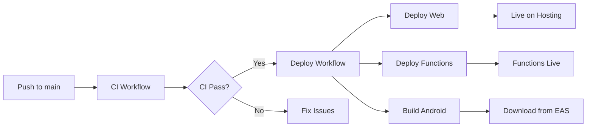

# FlipFeeds - CI/CD & Deployment Guide

**Part 3: Continuous Integration, Versioning, and Deployment**

---

## Table of Contents

1. [Versioning Strategy with Changesets](#versioning-strategy)
2. [GitHub Actions Setup](#github-actions-setup)
3. [Continuous Integration (CI)](#continuous-integration)
4. [Deployment Workflows](#deployment-workflows)
5. [Environment Setup](#environment-setup)

---

## Versioning Strategy with Changesets

### What Are Changesets?

Changesets is a tool for managing versions and changelogs in a monorepo. It helps you:
- Track which packages have changed
- Generate semantic version bumps
- Create changelogs automatically
- Coordinate releases across multiple packages

### How Changesets Work

1. **Developer creates a changeset** when making changes
2. **Changesets are committed** with the code changes
3. **On merge to main**, a bot creates a "Version Packages" PR
4. **When Version PR is merged**, packages are published/versioned

---

## Setting Up Changesets

### Step 1: Initialize Changesets

```bash
# From monorepo root
pnpm add -D @changesets/cli
pnpm changeset init
```

This creates a `.changeset` directory with configuration.

### Step 2: Configure Changesets

Edit `.changeset/config.json`:

```json
{
  "$schema": "https://unpkg.com/@changesets/config@2.3.0/schema.json",
  "changelog": "@changesets/cli/changelog",
  "commit": false,
  "fixed": [],
  "linked": [],
  "access": "restricted",
  "baseBranch": "main",
  "updateInternalDependencies": "patch",
  "ignore": [
    "@flip-feeds/mobile",
    "@flip-feeds/web"
  ]
}
```

**Configuration explained:**
- `changelog`: Use default changelog generator
- `commit`: Don't auto-commit changeset files
- `ignore`: Don't version apps (only packages)
- `baseBranch`: Main branch for releases

### Step 3: Create Your First Changeset

When you make changes to a package:

```bash
pnpm changeset
```

This interactive prompt asks:
1. **Which packages changed?** (select with space, enter to confirm)
2. **What type of change?** (major, minor, patch)
3. **Describe the change** (for changelog)

Example flow:

```
🦋  Which packages would you like to include?
◯ changed packages
  ◉ @flip-feeds/firebase-config
  ◉ @flip-feeds/shared-logic
  ◯ @flip-feeds/ui-components

🦋  Which packages should have a major bump?
◯ all packages
  ◯ @flip-feeds/firebase-config
  ◯ @flip-feeds/shared-logic

🦋  Which packages should have a minor bump?
◯ all packages
  ◉ @flip-feeds/shared-logic

🦋  Which packages should have a patch bump?
◯ all packages
  ◉ @flip-feeds/firebase-config

🦋  Please enter a summary for this change:
Add authentication hooks and Firebase emulator support
```

This creates a file like `.changeset/brave-lions-sing.md`:

```markdown
---
"@flip-feeds/shared-logic": minor
"@flip-feeds/firebase-config": patch
---

Add authentication hooks and Firebase emulator support
```

### Step 4: Commit the Changeset

```bash
git add .changeset/brave-lions-sing.md
git commit -m "feat: add auth hooks and emulator support"
```

---

## GitHub Actions Setup

### Required GitHub Secrets

Navigate to: **Settings → Secrets and variables → Actions → New repository secret**

Add these secrets:

#### Firebase Secrets

| Secret Name | Description | How to Get |
|------------|-------------|------------|
| `FIREBASE_TOKEN` | Firebase CI token | `firebase login:ci` |
| `FIREBASE_SERVICE_ACCOUNT` | Service account JSON | Firebase Console → Project Settings → Service Accounts |
| `FIREBASE_PROJECT_ID` | Your Firebase project ID | Firebase Console |

#### Firebase Environment Variables (for Web App)

| Secret Name | Example Value |
|------------|---------------|
| `NEXT_PUBLIC_FIREBASE_API_KEY` | `AIzaSyXXXXXXXXXXXXXXXXXX` |
| `NEXT_PUBLIC_FIREBASE_AUTH_DOMAIN` | `flipfeeds.firebaseapp.com` |
| `NEXT_PUBLIC_FIREBASE_PROJECT_ID` | `flipfeeds` |
| `NEXT_PUBLIC_FIREBASE_STORAGE_BUCKET` | `flipfeeds.appspot.com` |
| `NEXT_PUBLIC_FIREBASE_MESSAGING_SENDER_ID` | `123456789012` |
| `NEXT_PUBLIC_FIREBASE_APP_ID` | `1:123456789012:web:abcdef` |

#### Expo Secrets (for Mobile)

| Secret Name | Description | How to Get |
|------------|-------------|------------|
| `EXPO_TOKEN` | Expo access token | `eas login` then `eas whoami --json` |

### Getting Firebase Service Account

1. Go to Firebase Console → Project Settings
2. Click "Service Accounts" tab
3. Click "Generate New Private Key"
4. Download JSON file
5. Copy entire JSON content to `FIREBASE_SERVICE_ACCOUNT` secret

### Getting Firebase CI Token

```bash
firebase login:ci
```

Copy the token it generates to `FIREBASE_TOKEN` secret.

### Getting Expo Token

```bash
# Login to Expo
eas login

# Generate token
eas whoami --json
```

Or create a token at: https://expo.dev/accounts/[your-account]/settings/access-tokens

---

## Continuous Integration (CI)

The CI workflow (`.github/workflows/ci.yml`) runs on:
- Every push to `main` or `develop`
- Every pull request to `main` or `develop`

### What CI Does

1. **Setup**: Install dependencies with pnpm
2. **Lint**: Run ESLint and Prettier checks
3. **Type Check**: Run TypeScript compiler
4. **Build Packages**: Compile all shared packages
5. **Build Web**: Build Next.js app
6. **Build Mobile**: Type-check mobile app
7. **Test**: Run tests (when implemented)

### CI Workflow Breakdown

```yaml
# .github/workflows/ci.yml

jobs:
  setup:
    # Installs dependencies and caches them
    
  lint:
    # Runs ESLint and Prettier
    # Fails if code isn't properly formatted
    
  typecheck:
    # Runs TypeScript compiler in all packages
    # Ensures type safety across monorepo
    
  build-packages:
    # Builds @flip-feeds/* packages
    # Ensures packages compile correctly
    
  build-web:
    # Builds Next.js app with Firebase env vars
    # Creates production-ready static export
    
  build-mobile-check:
    # Type-checks mobile app
    # Ensures mobile code compiles
```

### Viewing CI Results

1. Go to your repo on GitHub
2. Click "Actions" tab
3. See workflow runs and their status
4. Click any run to see detailed logs

### CI Badge

Add to your README.md:

```markdown

```

---

## Deployment Workflows

### Web Deployment to Firebase Hosting

The deploy workflow (`.github/workflows/deploy.yml`) automatically deploys when:
- Code is pushed to `main` branch
- CI workflow passes successfully

**What happens:**

1. ✅ Install dependencies
2. 📦 Build shared packages
3. 🏗️ Build Next.js app (static export)
4. 🚀 Deploy to Firebase Hosting
5. 🔗 Get deployment URL

**Accessing the deployed site:**

```
https://[your-project-id].web.app
```

### Firebase Functions Deployment

Functions are deployed in the same workflow:

1. 📦 Build functions package
2. 🚀 Deploy to Firebase Functions
3. ✅ Verify deployment

**Deployed functions available at:**

```
https://us-central1-[project-id].cloudfunctions.net/[function-name]
```

### Mobile App Builds (EAS)

Mobile builds use **Expo Application Services (EAS)** for cloud builds.

#### Setting Up EAS

1. **Install EAS CLI** (if not already):
   ```bash
   npm install -g eas-cli
   ```

2. **Login to Expo**:
   ```bash
   eas login
   ```

3. **Configure EAS** in `apps/mobile`:
   ```bash
   cd apps/mobile
   eas build:configure
   ```

   This creates `eas.json`:

   ```json
   {
     "cli": {
       "version": ">= 5.0.0"
     },
     "build": {
       "development": {
         "developmentClient": true,
         "distribution": "internal",
         "android": {
           "gradleCommand": ":app:assembleDebug"
         },
         "ios": {
           "buildConfiguration": "Debug"
         }
       },
       "preview": {
         "distribution": "internal",
         "android": {
           "buildType": "apk"
         }
       },
       "production": {
         "android": {
           "buildType": "aab"
         },
         "ios": {
           "buildConfiguration": "Release"
         }
       }
     },
     "submit": {
       "production": {
         "android": {
           "serviceAccountKeyPath": "../path/to/api-key.json",
           "track": "internal"
         },
         "ios": {
           "appleId": "your-apple-id@example.com",
           "ascAppId": "1234567890",
           "appleTeamId": "AB12CD34EF"
         }
       }
     }
   }
   ```

4. **Build for Android** (Production):
   ```bash
   cd apps/mobile
   eas build --platform android --profile production
   ```

   This creates an `.aab` file ready for Play Store.

5. **Build for iOS** (Production):
   ```bash
   cd apps/mobile
   eas build --platform ios --profile production
   ```

   This creates an `.ipa` file ready for App Store.

### Automated Mobile Builds

The deploy workflow includes automated builds:

**Android Build (runs automatically on push to main):**

```yaml
build-android:
  runs-on: ubuntu-latest
  steps:
    - name: Build Android app with EAS
      run: |
        eas build \
          --platform android \
          --profile production \
          --non-interactive \
          --no-wait
```

**iOS Build (manual trigger only):**

```yaml
build-ios:
  runs-on: macos-latest
  if: github.event_name == 'workflow_dispatch'
  steps:
    - name: Build iOS app with EAS
      run: |
        eas build \
          --platform ios \
          --profile production \
          --non-interactive \
          --no-wait
```

### Manually Triggering iOS Build

1. Go to GitHub Actions
2. Click "Deploy" workflow
3. Click "Run workflow"
4. Select branch
5. Click "Run workflow" button

This triggers both web and iOS builds.

---

## Complete Deployment Flow

### Automatic Deployment (Push to Main)



### Manual Deployment Steps

#### Deploy Web Only

```bash
# Build web app
pnpm --filter web build

# Deploy to Firebase Hosting
firebase deploy --only hosting
```

#### Deploy Functions Only

```bash
# Build functions
pnpm --filter functions build

# Deploy
firebase deploy --only functions
```

#### Build Mobile App

```bash
cd apps/mobile

# Android
eas build --platform android --profile production

# iOS
eas build --platform ios --profile production
```

---

## Versioning Workflow

### Creating Releases with Changesets

#### Step 1: Create Changesets During Development

Every PR with package changes should include a changeset:

```bash
pnpm changeset
# Select packages, bump type, and description
git add .changeset/*
git commit -m "feat: your feature"
```

#### Step 2: Version Packages PR (Automated)

When changesets are merged to `main`:

1. GitHub Action runs (`.github/workflows/version.yml`)
2. Bot creates/updates a "Version Packages" PR
3. This PR includes:
   - Version bumps in `package.json` files
   - Updated `CHANGELOG.md` files
   - Consumed changeset files removed

#### Step 3: Release (Merge Version PR)

When you merge the "Version Packages" PR:

1. Packages are published (if you're publishing to npm)
2. Git tags are created
3. GitHub releases are created
4. Changelogs are updated

---

## Environment-Specific Deployments

### Development Environment

```bash
# Use emulators
NEXT_PUBLIC_USE_EMULATOR=true pnpm dev

# Or deploy to Firebase dev project
firebase use dev
firebase deploy
```

### Staging Environment

```bash
# Deploy to staging project
firebase use staging
pnpm build
firebase deploy
```

### Production Environment

```bash
# Deploy via GitHub Actions (recommended)
git push origin main

# Or manually
firebase use production
pnpm build
firebase deploy
```

---

## Monitoring Deployments

### Firebase Hosting

View deployments:
```bash
firebase hosting:channel:list
```

View deployment history in Firebase Console:
- Console → Hosting → Release History

### EAS Builds

View builds:
```bash
eas build:list
```

Or visit: https://expo.dev/accounts/[your-account]/projects/flipfeeds/builds

### GitHub Actions

Monitor all workflows at:
```
https://github.com/codercatdev/flipfeeds-app/actions
```

---

## Rollback Procedures

### Web App Rollback

```bash
# List previous releases
firebase hosting:channel:list

# Rollback to specific version
firebase hosting:rollback
```

### Functions Rollback

Functions are versioned automatically. Redeploy previous version:

```bash
git checkout <previous-commit>
firebase deploy --only functions
```

### Mobile App Rollback

Use EAS Update for over-the-air updates:

```bash
cd apps/mobile
eas update --branch production --message "Rollback to previous version"
```

For full app rollback, submit previous build to stores.

---

## Best Practices

### 1. Always Create Changesets

```bash
# Before pushing code
pnpm changeset
```

### 2. Test Locally Before Deploying

```bash
# Build everything locally
pnpm build

# Test web build
cd apps/web
pnpm start

# Test mobile build
cd apps/mobile
eas build --platform android --profile preview
```

### 3. Use Preview Deployments

```bash
# Deploy to preview channel
firebase hosting:channel:deploy preview-feature-x

# Share URL for testing
# https://flipfeeds--preview-feature-x-<hash>.web.app
```

### 4. Monitor Build Times

Keep an eye on GitHub Actions usage:
- Settings → Billing → Actions usage

Optimize:
- Use caching effectively
- Parallelize jobs when possible
- Skip unnecessary jobs (e.g., iOS builds on PR)

### 5. Semantic Versioning

Follow semver strictly:
- **Major (1.0.0 → 2.0.0)**: Breaking changes
- **Minor (1.0.0 → 1.1.0)**: New features (backward compatible)
- **Patch (1.0.0 → 1.0.1)**: Bug fixes

---

## Troubleshooting

### CI Failing on Type Check

```bash
# Run locally to see errors
pnpm typecheck

# Fix errors, then commit
```

### Deploy Failing - Firebase Token Expired

```bash
# Generate new token
firebase login:ci

# Update FIREBASE_TOKEN secret in GitHub
```

### EAS Build Failing

```bash
# Check build logs
eas build:list
eas build:view [build-id]

# Common issues:
# - Missing credentials
# - Invalid eas.json
# - Native code errors
```

### Web App Not Loading After Deploy

Check:
1. Firebase Hosting rewrites in `firebase.json`
2. Environment variables in build
3. Browser console for errors
4. Firebase Hosting logs

---

## Summary Checklist

### Initial Setup
- [ ] Install pnpm, Firebase CLI, EAS CLI
- [ ] Set up GitHub secrets
- [ ] Initialize Changesets
- [ ] Configure EAS

### For Each Release
- [ ] Create changeset for package changes
- [ ] Push to GitHub
- [ ] Verify CI passes
- [ ] Merge to main
- [ ] Monitor deployment
- [ ] Test deployed apps
- [ ] Merge "Version Packages" PR when ready

### Regular Maintenance
- [ ] Monitor build times
- [ ] Review deployment logs
- [ ] Update dependencies monthly
- [ ] Review and rotate secrets annually

---

## Additional Resources

- **Changesets**: https://github.com/changesets/changesets
- **GitHub Actions**: https://docs.github.com/en/actions
- **Firebase Hosting**: https://firebase.google.com/docs/hosting
- **EAS Build**: https://docs.expo.dev/build/introduction/
- **Semantic Versioning**: https://semver.org/
