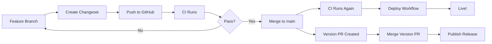

# FlipFeeds Monorepo - Quick Reference

**Essential commands and workflows at a glance**

---

## 🚀 Getting Started (5 Minutes)

```bash
# 1. Install dependencies
pnpm install

# 2. Start emulators
firebase emulators:start  # Terminal 1

# 3. Start development
pnpm dev                  # Terminal 2
```

**Boom! You're running:**
- 🌐 Web at http://localhost:3000
- 📱 Mobile via Expo Dev Tools
- 🔥 Firebase Emulators at http://localhost:4000

---

## 📝 File Locations Quick Map

### Configuration Templates
All ready-to-use configs are in `monorepo-configs/`:

```
monorepo-configs/
├── pnpm-workspace.yaml              → Root workspace config
├── package.json                     → Root package.json
├── tsconfig.base.json               → Base TypeScript config
├── firebase.json                    → Firebase config
├── apps-mobile-package.json         → Mobile app package.json
├── apps-mobile-tsconfig.json        → Mobile TypeScript config
├── apps-web-package.json            → Web app package.json
├── apps-web-tsconfig.json           → Web TypeScript config
├── apps-web-next.config.js          → Next.js config
├── packages-firebase-config-*       → Firebase package configs
├── packages-shared-logic-*          → Shared logic configs
├── packages-ui-components-*         → UI components configs
└── .github-workflows-*.yml          → CI/CD workflows
```

### Implementation Guides

```
📖 MONOREPO_GUIDE.md      → Architecture & rationale
📖 MIGRATION_GUIDE.md     → Step-by-step migration
📖 CICD_GUIDE.md          → Deployment & versioning
📖 MONOREPO_README.md     → Complete overview
📖 QUICK_REFERENCE.md     → This file
```

---

## 💻 Essential Commands

### Development

| Command | What it does |
|---------|--------------|
| `pnpm dev` | Start all apps |
| `pnpm dev:web` | Start Next.js only |
| `pnpm dev:mobile` | Start Expo only |
| `pnpm build` | Build everything |
| `pnpm build:packages` | Build shared packages |

### Code Quality

| Command | What it does |
|---------|--------------|
| `pnpm lint` | Run ESLint |
| `pnpm lint:fix` | Fix lint errors |
| `pnpm typecheck` | Check TypeScript |
| `pnpm format` | Format with Prettier |
| `pnpm format:check` | Check formatting |

### Workspace Management

| Command | What it does |
|---------|--------------|
| `pnpm --filter web <cmd>` | Run command in web app |
| `pnpm --filter mobile <cmd>` | Run command in mobile app |
| `pnpm --filter @flip-feeds/ui-components <cmd>` | Run in package |
| `pnpm -r <cmd>` | Run in all packages |

### Versioning

| Command | What it does |
|---------|--------------|
| `pnpm changeset` | Create a changeset |
| `pnpm version-packages` | Version packages |
| `pnpm release` | Publish packages |

---

## 🏗 Migration Checklist

### Phase 1: Setup (15 min)
- [ ] Backup current code (`git checkout -b backup-before-monorepo`)
- [ ] Create monorepo branch (`git checkout -b feat/monorepo-migration`)
- [ ] Create directory structure (`mkdir -p apps/{mobile,web} packages/...`)
- [ ] Copy all config files from `monorepo-configs/`

### Phase 2: Mobile Migration (30 min)
- [ ] Move `app/` to `apps/mobile/app/`
- [ ] Move `assets/`, `components/`, etc.
- [ ] Update `metro.config.js` for monorepo
- [ ] Update imports to use workspace packages

### Phase 3: Web App (20 min)
- [ ] Create Next.js structure in `apps/web/`
- [ ] Copy web configs from `monorepo-configs/`
- [ ] Create basic pages
- [ ] Test web app runs

### Phase 4: Shared Packages (30 min)
- [ ] Extract Firebase config to `packages/firebase-config/`
- [ ] Move shared hooks to `packages/shared-logic/`
- [ ] Move UI components to `packages/ui-components/`
- [ ] Update all imports

### Phase 5: Testing (30 min)
- [ ] `pnpm install` - Install all dependencies
- [ ] `pnpm build:packages` - Build packages
- [ ] `firebase emulators:start` - Start emulators
- [ ] `pnpm dev` - Start apps
- [ ] Test mobile on Android emulator
- [ ] Test web at localhost:3000

### Phase 6: CI/CD (20 min)
- [ ] Copy workflows to `.github/workflows/`
- [ ] Set up GitHub secrets
- [ ] Push to GitHub
- [ ] Verify CI passes

**Total time: ~2.5 hours**

---

## 📦 Package Dependency Graph

```
┌─────────────────────────────────────────┐
│          apps/mobile                    │
│          apps/web                       │
└─────────────────┬───────────────────────┘
                  │
                  ├─────────────────────────────┐
                  │                             │
         ┌────────▼────────┐          ┌─────────▼──────────┐
         │ @flip-feeds/    │          │  @flip-feeds/      │
         │ shared-logic    │◄─────────┤  ui-components     │
         └────────┬────────┘          └────────────────────┘
                  │
         ┌────────▼────────┐
         │ @flip-feeds/    │
         │ firebase-config │
         └─────────────────┘
```

---

## 🔧 Environment Setup

### Development (.env.local)

```bash
# Firebase Config
NEXT_PUBLIC_FIREBASE_API_KEY=your_key
NEXT_PUBLIC_FIREBASE_AUTH_DOMAIN=your_domain
NEXT_PUBLIC_FIREBASE_PROJECT_ID=your_project
NEXT_PUBLIC_FIREBASE_STORAGE_BUCKET=your_bucket
NEXT_PUBLIC_FIREBASE_MESSAGING_SENDER_ID=your_sender
NEXT_PUBLIC_FIREBASE_APP_ID=your_app_id

# Use Emulators
NEXT_PUBLIC_USE_EMULATOR=true
```

### GitHub Secrets (Production)

```bash
# Firebase
FIREBASE_TOKEN
FIREBASE_SERVICE_ACCOUNT
FIREBASE_PROJECT_ID

# Expo
EXPO_TOKEN

# Firebase Config (for builds)
NEXT_PUBLIC_FIREBASE_API_KEY
NEXT_PUBLIC_FIREBASE_AUTH_DOMAIN
# ... (all Firebase config vars)
```

---

## 🎯 Common Workflows

### Adding a New Feature

```bash
# 1. Create branch
git checkout -b feat/new-feature

# 2. Make changes
# Edit files in packages/ or apps/

# 3. Create changeset (if package changed)
pnpm changeset

# 4. Test locally
pnpm dev

# 5. Commit and push
git add .
git commit -m "feat: add new feature"
git push origin feat/new-feature

# 6. Create PR
# GitHub will run CI automatically
```

### Deploying to Production

```bash
# Automatic (recommended):
git push origin main  # CI/CD handles it

# Manual:
pnpm build
firebase deploy --only hosting
firebase deploy --only functions
```

### Building Mobile App

```bash
cd apps/mobile

# Android
eas build --platform android --profile production

# iOS  
eas build --platform ios --profile production

# Check status
eas build:list
```

---

## 🐛 Troubleshooting Quick Fixes

### "Can't find module '@flip-feeds/...'"

```bash
pnpm build:packages  # Build packages first
```

### Metro bundler issues

```bash
cd apps/mobile
rm -rf node_modules .expo
pnpm install
pnpm start --clear
```

### Next.js build errors

```bash
cd apps/web
rm -rf .next node_modules
pnpm install
pnpm build
```

### TypeScript errors everywhere

```bash
# From root
pnpm install
pnpm build:packages
```

### Firebase emulator won't start

```bash
firebase emulators:start --clear-cache
```

---

## 📱 Running on Android Emulator

```bash
# 1. Start emulator (Android Studio or CLI)
emulator -avd Pixel_5_API_33

# 2. Start Firebase emulators
firebase emulators:start

# 3. Start mobile app
cd apps/mobile
pnpm android

# Or if Expo is already running, press 'a'
```

**Troubleshooting Android:**
- Emulator not detected? Check `adb devices`
- Metro bundler errors? Clear cache: `pnpm start --clear`
- Build errors? Clean: `cd android && ./gradlew clean`

---

## 🌐 Accessing Apps & Services

### Development URLs

| Service | URL |
|---------|-----|
| Web App | http://localhost:3000 |
| Emulator UI | http://localhost:4000 |
| Firestore Emulator | http://localhost:8080 |
| Auth Emulator | http://localhost:9099 |
| Storage Emulator | http://localhost:9199 |
| Functions Emulator | http://localhost:5001 |

### Production URLs

| Service | URL Pattern |
|---------|-------------|
| Web App | `https://[project-id].web.app` |
| Functions | `https://us-central1-[project-id].cloudfunctions.net/[function]` |
| Mobile App | App/Play Store |

---

## 📊 CI/CD Status Checks

### What CI Checks

✅ ESLint  
✅ Prettier  
✅ TypeScript  
✅ Build packages  
✅ Build web app  
✅ Build mobile (type-check)  

### Deploy Triggers

- **Web**: Automatic on push to `main`
- **Functions**: Automatic on push to `main`
- **Mobile (Android)**: Automatic on push to `main`
- **Mobile (iOS)**: Manual trigger only

---

## 🔄 Git Workflow



---

## 🎓 Key Concepts

### Workspace Packages

```json
{
  "name": "@flip-feeds/ui-components",
  "version": "1.0.0"
}
```

- Scoped with `@flip-feeds/`
- Versioned independently
- Used with `workspace:*` in dependencies

### Changesets

```bash
pnpm changeset  # Create
# → Select packages
# → Choose version bump (major/minor/patch)
# → Write description
```

Creates `.changeset/random-words.md`

### pnpm Filtering

```bash
# Run in one package
pnpm --filter web build

# Run in multiple
pnpm --filter "./apps/*" build

# Run in all
pnpm -r build
```

---

## 💡 Pro Tips

### Faster Installs

```bash
# Use frozen lockfile in CI
pnpm install --frozen-lockfile

# Prefer offline
pnpm install --prefer-offline
```

### Better DX

```bash
# Auto-format on save in VS Code
# .vscode/settings.json
{
  "editor.formatOnSave": true,
  "editor.defaultFormatter": "esbenp.prettier-vscode"
}
```

### Debugging Workspace Issues

```bash
# List all workspace packages
pnpm list -r --depth 0

# Check dependency tree
pnpm why <package-name>

# Verify links
ls -la node_modules/@flip-feeds
```

---

## 📞 Where to Find Help

| Question | Look Here |
|----------|-----------|
| "What's the architecture?" | MONOREPO_GUIDE.md |
| "How do I migrate?" | MIGRATION_GUIDE.md |
| "How do I deploy?" | CICD_GUIDE.md |
| "Where's the config?" | monorepo-configs/ |
| "Quick command?" | This file |

---

## ✅ Daily Checklist

### Starting Your Day

```bash
☐ git pull origin main
☐ pnpm install  # If package.json changed
☐ firebase emulators:start  # Terminal 1
☐ pnpm dev  # Terminal 2
☐ git checkout -b feat/your-feature
```

### Before Committing

```bash
☐ pnpm lint
☐ pnpm typecheck
☐ pnpm changeset  # If package changed
☐ git add .
☐ git commit -m "feat: ..."
☐ git push
```

### Before Merging PR

```bash
☐ CI passed
☐ Code reviewed
☐ Tested locally
☐ Changeset created (if needed)
☐ Docs updated
```

---

## 🎉 You're Ready!

**Everything you need to know:**

1. ✅ Config files are in `monorepo-configs/`
2. ✅ Guides are in root (MONOREPO_GUIDE.md, etc.)
3. ✅ Use `pnpm dev` to start everything
4. ✅ Use `pnpm changeset` for versioning
5. ✅ Push to main triggers deployment

**Start here:**

```bash
cat MIGRATION_GUIDE.md
# Follow step by step
```

**Questions? Check the guides!**

---

*FlipFeeds Monorepo - Built with ❤️ using pnpm, Next.js, Expo, and Firebase*
